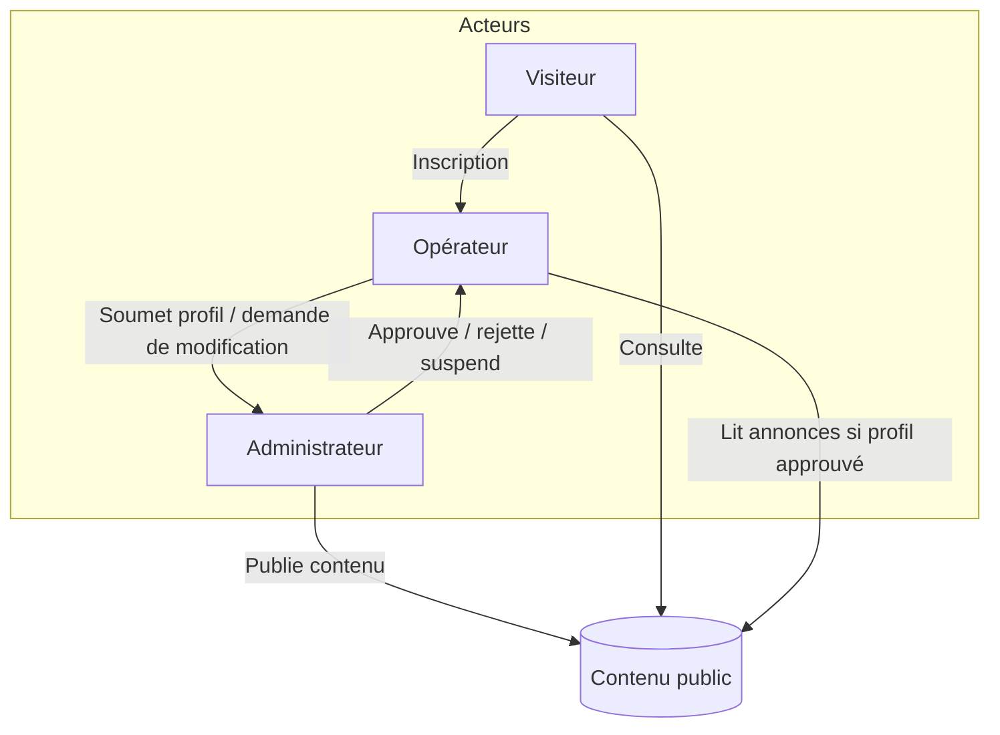
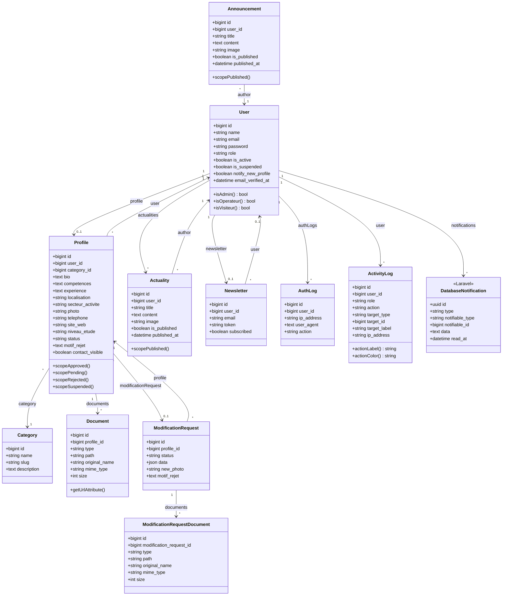

# Rapport d’analyse — Communautaire Gestion

Application web **Laravel 11** pour la gestion d’une communautaire : annuaire de profils professionnels, validation par un administrateur, actualités, annonces et newsletter. Ce document synthétise l’analyse du code (routes, contrôleurs, modèles, middleware).

---

## 1. Vue d’ensemble technique

| Élément | Détail |
|--------|--------|
| Framework | Laravel 11 |
| Base de données | SQLite (`database/database.sqlite`) |
| Authentification | Session, vérification d’email (`MustVerifyEmail`), rôles (`admin`, `operateur`, `visiteur` en schéma ; inscription force `operateur`) |
| Middleware métier | `CheckRole`, `CheckActive` (déconnexion si compte suspendu) |
| Exports | Excel (Maatwebsite), PDF (DomPDF) |

---

## 2. Acteurs

| Acteur | Description | Accès principal |
|--------|-------------|-----------------|
| **Visiteur** | Utilisateur non connecté | Pages publiques : liste de profils, fiche profil, annuaire par catégorie, actualités, inscription newsletter |
| **Opérateur** | Utilisateur enregistré avec `role = operateur` (création de compte), email vérifié, compte non suspendu | Préfixe `/mon-espace` : profil, documents, demandes de modification, annonces publiées (lecture), paramètres compte / mot de passe / newsletter |
| **Administrateur** | Utilisateur avec `role = admin` | Préfixe `/admin` : tableau de bord, profils (validation, suspension, export ZIP documents), catégories, actualités, annonces, demandes de modification, utilisateurs, newsletter (envoi), logs d’activité, exports Excel/PDF, paramètres |
| **Système** (secondaire) | Jobs, mails, notifications base de données | Emails (soumission profil, approbation/rejet, modifications), notifications in-app Laravel |

### 2.1 Liens entre les acteurs

- Le **Visiteur** peut **devenir Opérateur** en s’inscrivant : le contrôleur d’inscription crée un compte avec le rôle `operateur` et oriente vers la création de profil.
- L’**Opérateur** **soumet** un profil et des pièces ; l’**Administrateur** **valide, rejette ou suspend** ; le **Visiteur** ne voit que les profils **approuvés** dont l’utilisateur n’est pas suspendu.
- L’**Opérateur** dont le profil est **déjà approuvé** envoie des **demandes de modification** ; l’**Administrateur** les **approuve ou refuse** ; le profil public reste l’ancienne version jusqu’à décision.
- L’**Administrateur** **gère les comptes** (actif, suspension, suppression) et peut consulter les **journaux de connexion** par utilisateur ; une **suspension** déconnecte l’opérateur à la prochaine requête protégée.
- L’**Administrateur** **publie** actualités et annonces ; l’**Opérateur** **consulte** les annonces publiées (si son profil est approuvé) ; le **Visiteur** consulte les **actualités** publiées.

### 2.2 Diagramme des acteurs et interactions (Mermaid)

---

## 3. Cas d’utilisation (liste)

### 3.1 Visiteur

1. Consulter la liste des profils approuvés (filtres recherche / catégorie).
2. Consulter le détail d’un profil approuvé.
3. Consulter l’annuaire par catégories.
4. Consulter les profils d’une catégorie.
5. Consulter les actualités publiées (filtrage par mois possible).
6. S’abonner à la newsletter (email).
7. Se désabonner via lien token.
8. S’inscrire (devenir opérateur).
9. Se connecter / se déconnecter.
10. Demander réinitialisation du mot de passe.

### 3.2 Opérateur (connecté, vérifié, actif)

11. Créer et soumettre un profil (statut `pending`).
12. Consulter son profil et ses documents.
13. Mettre à jour le profil : si `pending`/`rejected`, mise à jour directe ; si `approved`, création d’une **demande de modification** (une seule en attente).
14. Basculer la visibilité publique des coordonnées (`contact_visible`).
15. Supprimer un de ses documents joints.
16. Consulter les annonces publiées (bloqué tant que le profil n’est pas approuvé).
17. Modifier compte, mot de passe, préférences newsletter (espace paramètres).
18. Consulter et marquer comme lues les notifications (cloche / API JSON).

### 3.3 Administrateur

19. Accéder au tableau de bord.
20. Lister / filtrer les profils ; voir le détail.
21. Approuver, rejeter (avec motif), suspendre un profil.
22. Exporter les documents d’un profil en ZIP.
23. Supprimer un profil.
24. CRUD catégories (sans routes show/create/edit dédiées — resource restreint) ; reclassifier avant suppression.
25. Gérer les actualités (création, édition, publication, suppression).
26. Gérer les annonces (création, édition, suppression).
27. Lister et traiter les demandes de modification (approuver / refuser).
28. Exporter les profils en Excel ou PDF.
29. Lister les utilisateurs ; activer/désactiver ; suspendre/levée ; supprimer ; voir logs d’auth.
30. Page newsletter admin ; envoi (contrôleur dédié).
31. Consulter les logs d’activité applicatifs.
32. Paramètres admin : compte, mot de passe, notifications (ex. alerte nouveau profil).

---

## 4. Description détaillée des cas d’utilisation (synthèse)

| ID | Cas d’utilisation | Acteur principal | Description |
|----|-------------------|------------------|-------------|
| CU-01 | Consulter l’annuaire public | Visiteur | Pagination des profils `approved` avec utilisateur actif et non suspendu ; filtres catégorie et recherche (nom, bio, secteur). |
| CU-02 | Voir un profil | Visiteur | Affichage refusé (404) si profil non approuvé ou utilisateur suspendu. |
| CU-03 | Parcourir par catégorie | Visiteur | Comptage des profils approuvés par catégorie ; liste paginée dans une catégorie. |
| CU-04 | Lire les actualités | Visiteur | Liste des actualités `is_published` ; filtre par mois (`published_at`). |
| CU-05 | Newsletter | Visiteur | Abonnement par email (`firstOrCreate`, email de bienvenue) ; désabonnement par token. |
| CU-06 | Authentification | Visiteur → Opérateur | Connexion, déconnexion, inscription (rôle `operateur`), vérification email, mot de passe oublié. |
| CU-07 | Créer / soumettre un profil | Opérateur | Formulaire validé (`ProfileRequest`) ; `ProfileService::submit` : profil en `pending`, photo, CV obligatoire, autres fichiers ; emails et notification admin si nouveau profil. |
| CU-08 | Modifier le profil | Opérateur | Si approuvé : `submitModificationRequest` (pas de seconde demande `pending`) ; sinon resoumission directe via `submit`. |
| CU-09 | Gérer visibilité des contacts | Opérateur | `PATCH` sur `contact_visible`. |
| CU-10 | Supprimer un document | Opérateur | Vérification propriété du document ; journalisation. |
| CU-11 | Lire les annonces | Opérateur | Uniquement annonces publiées ; accès conditionné à un profil existant et `status === approved`. |
| CU-12 | Paramètres opérateur | Opérateur | Mise à jour compte, mot de passe, liaison préférences newsletter. |
| CU-13 | Notifications | Opérateur, Admin | Données JSON + marquage lu / tout lu ; redirection depuis payload. |
| CU-14 | Valider les profils | Admin | Approbation, rejet (motif min. 10 caractères), suspension ; effets métier + emails + notifications opérateur. |
| CU-15 | Gestion des profils (destruction, export) | Admin | Suppression profil ; export ZIP des fichiers du profil. |
| CU-16 | Catégories | Admin | Resource API-like sans certaines routes ; action de reclassification lors de la suppression. |
| CU-17 | Actualités & annonces | Admin | CRUD côté admin ; publication explicite pour les actualités (`publish`). |
| CU-18 | Demandes de modification | Admin | Liste, détail, approuver ou refuser ; application des données validées sur le profil (service). |
| CU-19 | Exports globaux | Admin | Excel et PDF des profils (`ExportController`). |
| CU-20 | Utilisateurs & sécurité | Admin | Toggle actif, suspension, suppression, consultation des `AuthLog` par utilisateur. |
| CU-21 | Newsletter admin | Admin | Interface dédiée pour campagnes / gestion (routes `admin.newsletter`). |
| CU-22 | Logs d’activité | Admin | Traçabilité des actions sensibles (`ActivityLogger` / `ActivityLog`). |

---

## 5. Diagramme de classes (domaine applicatif)

Le diagramme couvre les **modèles Eloquent** du dossier `app/Models`, complété par la table **`notifications`** (Laravel, relation `Notifiable` sur `User`). Les classes Mail, Notifications, contrôleurs et services ne sont pas modélisées ici pour garder le focus sur la **persistance et les associations métier**.

### 5.1 Mermaid — diagramme de classes complet

### 5.2 Légende des associations

| Association | Cardinalité | Signification |
|-------------|-------------|---------------|
| User — Profile | 1 : 0..1 | Un utilisateur a au plus un profil communautaire. |
| User — AuthLog | 1 : * | Historique des connexions / actions d’auth par utilisateur. |
| User — Actuality | 1 : * | Auteur des brouillons / actualités (champ `user_id`). |
| User — Newsletter | 1 : 0..1 | Liaison optionnelle après inscription avec le même email. |
| User — ActivityLog | 1 : * | Journal d’audit (actions admin ou métier tracées). |
| User — DatabaseNotification | 1 : * | Notifications Laravel en base (`notifiable` polymorphe, ici `User`). |
| Profile — Category | * : 1 | Chaque profil référence une catégorie. |
| Profile — Document | 1 : * | Pièces jointes (CV, autres). |
| Profile — ModificationRequest | 1 : 0..1 | Dernière demande pertinente exposée via `latestOfMany()` côté code. |
| ModificationRequest — ModificationRequestDocument | 1 : * | Fichiers attachés à une demande de modification. |
| Actuality / Announcement — User | * : 1 | Auteur (administrateur connecté en pratique). |

---

## 6. Références dans le code

- Routes : `routes/web.php` (découpage public / auth / opérateur / admin).
- Modèles : `app/Models/*.php`.
- Logique profil et modifications : `app/Services/ProfileService.php`.
- Middleware rôle : `app/Http/Middleware/CheckRole.php` ; suspension : `app/Http/Middleware/CheckActive.php`.

---

*Document généré à partir de l’analyse du dépôt au 26 mars 2026.*
